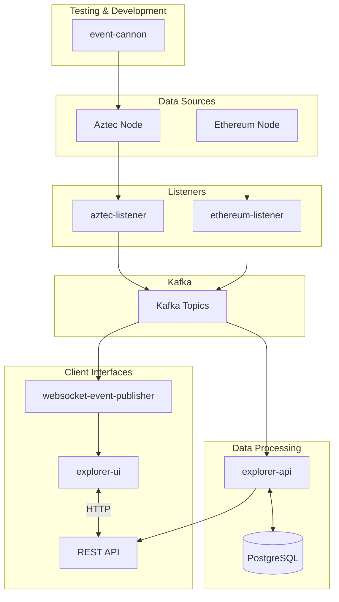

# Chicmoz - [aztecscan.xyz](https://aztecscan.xyz)

## running locally

Requirements:

- [minikube](https://minikube.sigs.k8s.io/docs/start/)
- [skaffold](https://skaffold.dev/docs/install/)
- [helm](https://helm.sh/docs/intro/install/)
- [yarn](https://yarnpkg.com/getting-started/install)

**terminal 1:**

```sh
minikube start --kubernetes-version=v1.25.3 --cpus max --memory max && skaffold run -f k8s/local/skaffold.default.yaml
```

**terminal 2:**

⚠️ _will ask for your password in order to port forward_

```sh
# It will end with keeping the terminal open for the tunnel.
./scripts/miscellaneous.sh
```

Now you can access the explorer at http://sandbox.chicmoz.localhost and also...

- API: http://api.sandbox.chicmoz.localhost
- index of API: http://api.sandbox.chicmoz.localhost/v1/dev-api-key/l2/index

### Different Aztec-setups

#### Option 0 - default

Default settings is to set up a sandbox in the local cluster.

#### Option 1 - connect to your already running sandbox or to public devnet

⚠️ _Make sure you have .chicmoz.env file in the root_

TODO

## Pro tip

### 1

if you run the explorer with `skaffold run -f k8s/local/skaffold.no_ui.yaml` you can run the explorer-ui locally for even faster frontend development:

```
yarn build:packages
cd /services/explorer-ui
yarn
yarn build
yarn dev
```

## Code Overview

### services/aztec-listener

The `aztec-listener` service is responsible for monitoring an Aztec network node and publishing events to Kafka topics. It acts as a bridge between the Aztec blockchain and the rest of the Chicmoz system.

**Key Features:**

- Connects to an Aztec network node to track blockchain state
- Polls for new blocks (both proposed and proven blocks)
- Detects pending transactions and publishes them to Kafka
- Monitors chain information and health
- Uses a database to track processed block heights and ensure consistent data handling
- Handles chain reorganizations gracefully

**Components:**

- **Block Poller**: Periodically checks for new blocks (both proposed and proven)
- **Transaction Poller**: Monitors for pending transactions
- **Chain Info Poller**: Fetches network status information
- **Message Bus**: Publishes events to Kafka topics for other services to consume

**Event Types Published:**

- Block events (new proposed/proven blocks)
- Pending transaction events
- Chain information events
- Node error events

### services/ethereum-listener

The `ethereum-listener` service monitors the Ethereum blockchain for events related to the Aztec network and publishes them to Kafka topics. It serves as a critical bridge between Ethereum (L1) and the Aztec ecosystem.

**Key Features:**

- Connects to an Ethereum node via HTTP and WebSocket RPC
- Watches for Aztec-related contract events on Ethereum
- Monitors L1 contract events that affect L2 state
- Maintains a record of processed L1 block heights
- Handles chain reorganizations on Ethereum

**Components:**

- **Events Watcher**: Subscribes to contract events on Ethereum
- **Contract Callbacks**: Processes specific events from Rollup contracts
- **Message Bus**: Publishes events to Kafka topics
- **Database Controllers**: Tracks heights and contract addresses

**Event Types Published:**

- L1 rollup contract events
- L2 validator status updates
- Chain connection status

### services/explorer-api

The `explorer-api` service provides a RESTful API for querying blockchain data. It consumes events from Kafka, processes them, and makes the data available through structured endpoints.

**Key Features:**

- Consumes events from both Ethereum and Aztec listeners
- Maintains a comprehensive database of blockchain state
- Provides RESTful API endpoints for querying data
- Supports advanced search capabilities
- Handles database schema migrations

**Components:**

- **HTTP Server**: Express-based API server with OpenAPI documentation
- **Database Controllers**: Logic for storing and retrieving different types of data
- **Event Handlers**: Process incoming events from Kafka
- **Schema Definitions**: Define the database structure and relationships

**Key Endpoints:**

- Block information
- Transaction details
- Contract classes and instances
- Chain statistics

### services/explorer-ui

The `explorer-ui` service provides a web interface for users to explore the Aztec blockchain data. It's a React-based frontend that communicates with the explorer-api.

**Key Features:**

- Rich, interactive UI for exploring blockchain data
- Real-time updates of new blocks and transactions
- Details views for blocks, transactions, and contracts
- Responsive design for mobile and desktop

**Components:**

- **React Frontend**: Modern React application with TypeScript
- **API Clients**: Type-safe clients for accessing explorer-api
- **UI Components**: Reusable components for displaying blockchain data
- **State Management**: Hooks and context for managing application state

### services/websocket-event-publisher

The `websocket-event-publisher` enables real-time updates to the UI by forwarding events from Kafka to connected clients via WebSockets.

**Key Features:**

- Connects to Kafka to consume relevant events
- Maintains WebSocket connections with clients
- Forwards events to subscribed clients in real-time
- Supports filtering events by type and content

**Components:**

- **WebSocket Server**: Manages client connections
- **Event Handler**: Processes events from Kafka and forwards to clients
- **Message Bus Client**: Subscribes to relevant Kafka topics

### services/event-cannon

The `event-cannon` is a testing utility that generates blockchain activity for development and testing purposes.

**Key Features:**

- Deploys test contracts to Aztec
- Executes transactions to generate blockchain activity
- Creates various scenarios for testing different parts of the system
- Configurable to simulate different types of activity

**Components:**

- **Scenario Runners**: Code to execute different test scenarios
- **Contract Artifacts**: Test contracts for deployment
- **PXE Integration**: Connects to the Private eXecution Environment

## Common Architecture Patterns

Based on the project structure, the Chicmoz services share several common architectural patterns:

1. **Microservice Design**: Each service is self-contained with its own:

   - Dockerfile for containerization
   - Database migrations
   - Configuration files
   - Kubernetes deployment manifests

2. **Consistent Directory Structure**:

   - `src/` - Source code
   - `src/svcs/` - Service implementations
   - `src/events/` - Event handlers (emitted and received)
   - `migrations/` - Database schema migrations

3. **Message-Driven Architecture**:

   - Services communicate through Kafka events
   - Clear separation between event producers and consumers
   - Well-defined event schemas

4. **Kubernetes Deployment**:

   - Extensive Kubernetes configuration
   - Environment-specific settings (sandbox, testnet, production)
   - Skaffold-based deployment pipeline

5. **TypeScript-Based Stack**:
   - Modern TypeScript codebase
   - Strong typing and interfaces
   - Consistent coding patterns across services

Services are designed to fulfill specific roles in the blockchain data pipeline:

- **Listeners** (aztec-listener, ethereum-listener): Watch blockchains and publish events
- **Processors** (explorer-api): Consume events and transform data
- **UI** (explorer-ui): Present data to users
- **Infrastructure** (websocket-event-publisher): Support real-time updates

This architecture enables scalable processing of blockchain data and provides a robust platform for building blockchain explorer and analytics applications.

## Architecture Diagram

Below is a textual description of the system architecture.



The architecture follows an event-driven pattern:

1. **Data Collection Layer**:

   - `aztec-listener` polls the Aztec node for new blocks, transactions, and chain info
   - `ethereum-listener` monitors Ethereum contracts related to Aztec

2. **Event Transport Layer**:

   - Kafka serves as the central message bus
   - All events are published to specific topics based on event type

3. **Data Processing Layer**:

   - `explorer-api` consumes events from Kafka
   - Processes and stores data in PostgreSQL
   - Provides a REST API for data access

4. **Presentation Layer**:

   - `websocket-event-publisher` forwards real-time events to clients
   - `explorer-ui` provides a user interface
   - REST API endpoints for programmatic access

5. **Testing & Development**:
   - `event-cannon` generates test transactions and contract deployments

## Service Configuration Documentation

### aztec-listener Configuration

| Environment Variable                                      | Description                                 | Default Value                    |
| --------------------------------------------------------- | ------------------------------------------- | -------------------------------- |
| `AZTEC_RPC_URL`                                           | URL of the Aztec node                       | `http://aztec-sandbox-node:8080` |
| `BLOCK_POLL_INTERVAL_MS`                                  | Polling interval for blocks in milliseconds | `500`                            |
| `AZTEC_LISTEN_FOR_PENDING_TXS`                            | Whether to listen for pending transactions  | `true`                           |
| `AZTEC_LISTEN_FOR_CHAIN_INFO`                             | Whether to listen for chain info updates    | `true`                           |
| `AZTEC_DISABLE_LISTEN_FOR_PROPOSED_BLOCKS`                | Disable listening for proposed blocks       | `false`                          |
| `AZTEC_DISABLE_LISTEN_FOR_PROVEN_BLOCKS`                  | Disable listening for proven blocks         | `false`                          |
| `AZTEC_LISTEN_FOR_PROVEN_BLOCKS_FORCED_START_FROM_HEIGHT` | Force start from a specific block height    | `undefined`                      |
| `L2_NETWORK_ID`                                           | Identifier for the L2 network               | Required                         |

### ethereum-listener Configuration

| Environment Variable     | Description                                 | Default Value                     |
| ------------------------ | ------------------------------------------- | --------------------------------- |
| `ETHEREUM_HTTP_RPC_URL`  | HTTP URL of the Ethereum node               | `http://anvil-ethereum-node:8545` |
| `ETHEREUM_WS_RPC_URL`    | WebSocket URL of the Ethereum node          | `ws://anvil-ethereum-node:8545`   |
| `BLOCK_POLL_INTERVAL_MS` | Polling interval for blocks in milliseconds | `500`                             |
| `LISTEN_FOR_BLOCKS`      | Whether to listen for blocks                | `true`                            |
| `GENESIS_CATCHUP`        | Whether to catch up from genesis            | `false`                           |
| `LISTENER_DISABLED`      | Disable the listener entirely               | `false`                           |
| `L2_NETWORK_ID`          | Identifier for the L2 network               | Required                          |

### explorer-api Configuration

| Environment Variable | Description                            | Default Value |
| -------------------- | -------------------------------------- | ------------- |
| `PORT`               | Port to run the HTTP server on         | `8000`        |
| `CORS_ORIGIN`        | CORS allowed origins                   | `*`           |
| `API_VERSION`        | API version for endpoints              | `v1`          |
| `L2_NETWORK_ID`      | Identifier for the L2 network          | Required      |
| `API_KEYS`           | Comma-separated list of valid API keys | `dev-api-key` |
| `THROTTLE_LIMIT`     | Rate limit for API calls               | `100`         |
| `THROTTLE_TTL`       | Rate limit time window in seconds      | `60`          |

### websocket-event-publisher Configuration

| Environment Variable    | Description                             | Default Value |
| ----------------------- | --------------------------------------- | ------------- |
| `WS_PORT`               | Port to run the WebSocket server on     | `8080`        |
| `L2_NETWORK_ID`         | Identifier for the L2 network           | Required      |
| `MAX_CONNECTIONS`       | Maximum number of WebSocket connections | `1000`        |
| `HEARTBEAT_INTERVAL_MS` | Interval for sending heartbeat messages | `30000`       |

### explorer-ui Configuration

| Environment Variable | Description                     | Default Value |
| -------------------- | ------------------------------- | ------------- |
| `VITE_API_URL`       | URL of the explorer-api service | `/api`        |
| `VITE_WS_URL`        | URL of the WebSocket service    | `/ws`         |
| `VITE_NETWORK_NAME`  | Human-readable network name     | `Sandbox`     |
| `VITE_L2_NETWORK_ID` | Identifier for the L2 network   | Required      |

## Common Development Workflows

### Adding a New Event Type

1. **Define the Event Schema**:

   - Add the new event type to `@chicmoz-pkg/message-registry`
   - Define the event payload structure and validation

2. **Update the Listener**:

   - Implement logic to detect the new event in the appropriate listener service
   - Create an emitter function in the events/emitted directory

3. **Implement the Consumer**:

   - Add a handler in explorer-api to process the new event
   - Update database schema if needed to store new data

4. **Update the WebSocket Publisher**:

   - Add the event to the list of events forwarded to clients
   - Implement any filtering logic needed

5. **Update the UI**:
   - Add components to display the new event data
   - Update API clients to fetch the new data

### Creating a New API Endpoint

1. **Define the Route**:

   - Add a new route in `explorer-api/src/svcs/http-server/routes`
   - Define validation for request parameters

2. **Implement the Controller**:

   - Create a controller function that handles the request
   - Add any necessary database queries or business logic

3. **Add Database Methods**:

   - Implement data access methods in the appropriate database controller
   - Ensure proper error handling and validation

4. **Update OpenAPI Spec**:

   - Add the new endpoint to the OpenAPI specification
   - Document request/response formats

5. **Create Tests**:
   - Add unit tests for the new endpoint
   - Test edge cases and error conditions

### Creating a New UI View

1. **Design the Component**:

   - Create new React components in the explorer-ui service
   - Define the component's props and state

2. **Add API Hooks**:

   - Create API hooks to fetch required data
   - Handle loading, error, and success states

3. **Add Routing**:

   - Update the routing configuration to include the new view
   - Set up any required route parameters

4. **Implement Real-time Updates**:

   - Subscribe to relevant WebSocket events
   - Update the UI when new data arrives

5. **Add Tests**:
   - Create tests for the new components
   - Test interaction and rendering

## API Documentation

The explorer-api service provides a RESTful API for accessing blockchain data. Below are the key endpoints:

### Blocks

#### `GET /api/v1/{apiKey}/l2/blocks`

Get a list of blocks with pagination.

**Query Parameters**:

- `page`: Page number (default: 1)
- `limit`: Items per page (default: 10)
- `sort`: Sort direction (asc/desc)
- `finalizationStatus`: Filter by finalization status

**Response**:

```json
{
  "blocks": [
    {
      "number": 123,
      "hash": "0x...",
      "timestamp": "2023-01-01T00:00:00Z",
      "transactionCount": 5,
      "finalizationStatus": "L2_NODE_SEEN_PROVEN"
    }
  ],
  "pagination": {
    "total": 1000,
    "page": 1,
    "limit": 10
  }
}
```

#### `GET /api/v1/{apiKey}/l2/blocks/{blockNumber}`

Get details of a specific block.

**Path Parameters**:

- `blockNumber`: Block number

**Response**:

```json
{
  "header": {
    "blockNumber": 123,
    "blockHash": "0x...",
    "timestamp": "2023-01-01T00:00:00Z",
    "parentHash": "0x..."
  },
  "body": {
    "transactionHashes": ["0x...", "0x..."],
    "version": "1.0.0"
  },
  "finalizationStatus": "L2_NODE_SEEN_PROVEN",
  "l1Data": {
    "rollupContractAddress": "0x...",
    "l1BlockNumber": 12345
  }
}
```

### Transactions

#### `GET /api/v1/{apiKey}/l2/txs`

Get a list of transactions with pagination.

**Query Parameters**:

- `page`: Page number (default: 1)
- `limit`: Items per page (default: 10)
- `sort`: Sort direction (asc/desc)
- `blockNumber`: Filter by block number

**Response**:

```json
{
  "transactions": [
    {
      "hash": "0x...",
      "blockNumber": 123,
      "timestamp": "2023-01-01T00:00:00Z",
      "contractAddress": "0x...",
      "functionName": "transfer"
    }
  ],
  "pagination": {
    "total": 1000,
    "page": 1,
    "limit": 10
  }
}
```

#### `GET /api/v1/{apiKey}/l2/txs/{txHash}`

Get details of a specific transaction.

**Path Parameters**:

- `txHash`: Transaction hash

**Response**:

```json
{
  "hash": "0x...",
  "blockNumber": 123,
  "timestamp": "2023-01-01T00:00:00Z",
  "contractAddress": "0x...",
  "functionName": "transfer",
  "parameters": {
    "from": "0x...",
    "to": "0x...",
    "amount": "100"
  },
  "status": "COMMITTED"
}
```

### Contracts

#### `GET /api/v1/{apiKey}/l2/contract-classes`

Get a list of contract classes.

**Query Parameters**:

- `page`: Page number (default: 1)
- `limit`: Items per page (default: 10)

**Response**:

```json
{
  "contractClasses": [
    {
      "id": "0x...",
      "name": "TokenContract",
      "version": "1.0.0",
      "instanceCount": 5
    }
  ],
  "pagination": {
    "total": 100,
    "page": 1,
    "limit": 10
  }
}
```

#### `GET /api/v1/{apiKey}/l2/contract-instances`

Get a list of contract instances.

**Query Parameters**:

- `page`: Page number (default: 1)
- `limit`: Items per page (default: 10)
- `classId`: Filter by contract class ID

**Response**:

```json
{
  "contractInstances": [
    {
      "address": "0x...",
      "classId": "0x...",
      "deploymentTxHash": "0x...",
      "deploymentBlockNumber": 123
    }
  ],
  "pagination": {
    "total": 200,
    "page": 1,
    "limit": 10
  }
}
```

## Kubernetes Configuration Structure

The `k8s` directory contains all Kubernetes configurations for deploying Chicmoz services in various environments. The structure follows a clear organization pattern that separates environments and services.

### Directory Organization

The k8s directory is divided into two main subdirectories:

- **local/**: Configurations for local development environments
- **production/**: Configurations for production deployments

Within each environment directory, you'll find:

1. **Service-specific directories**: Each service has its own directory containing:

   - `deployment.yaml`: Defines the Kubernetes Deployment
   - `service.yaml`: Defines the Kubernetes Service
   - `ingress.yaml` (when applicable): Defines ingress rules
   - `postgres-config.yaml` (for services with databases): Database configuration

2. **Environment variations**: Some services have configurations for different networks:

   - `local_devnet/`: For connecting to a local devnet
   - `remote_devnet/`: For connecting to a remote devnet
   - `sandbox/`: For the Aztec sandbox environment
   - `sp_testnet/`: For the Aztec testnet environment

3. **Common configurations**: Shared configurations in the `common/` directory:
   - `namespace.yaml`: Namespace definitions
   - `skaffold.base.yaml`: Base Skaffold configuration
   - `skaffold.infra.yaml`: Infrastructure components

### Skaffold Configuration

The project uses Skaffold extensively for deployment orchestration. Multiple Skaffold configuration files exist for different deployment scenarios:

- **skaffold.default.yaml**: Standard development setup with all services
- **skaffold.no_ui.yaml**: Backend-only deployment (useful when developing the UI locally)
- **skaffold.deluxe.yaml**: Full deployment with additional monitoring tools
- **Service-specific files**: Like `skaffold.only_aztec-listener.yaml` for deploying individual services

### Key Configuration Patterns

Several patterns are consistent throughout the Kubernetes configurations:

1. **Resource Management**:

   - Each deployment specifies CPU and memory requests/limits
   - Critical services have higher resource allocations

2. **Configuration Management**:

   - Environment variables loaded from ConfigMaps
   - Secrets managed consistently
   - Common patterns for database connections

3. **Network Configuration**:

   - Services exposed through consistent port naming
   - Ingress configurations with TLS where appropriate
   - Internal service communication through Kubernetes DNS

4. **Storage**:
   - Persistent storage for databases
   - Temporary storage for processing

The Kubernetes configurations are designed to be modular, allowing deployment of the entire stack or individual components as needed.

## Kubernetes Deployment Guide

The Chicmoz project is designed to be deployed on Kubernetes, with different configurations for development, testing, and production environments.

### Local Development

For local development, use the provided Skaffold configurations:

```sh
# Basic setup with all services
skaffold run -f k8s/local/skaffold.default.yaml

# Setup without UI (for frontend development)
skaffold run -f k8s/local/skaffold.no_ui.yaml

# Full setup with additional monitoring tools
skaffold run -f k8s/local/skaffold.deluxe.yaml

# Only specific services
skaffold run -f k8s/local/skaffold.only_aztec-listener.yaml
```

### Production Deployment

For production deployment, the process involves:

1. **Set up environment variables**:

   - Create a `.chicmoz.env` file with production settings
   - Set appropriate API keys, URLs, and resource limits

2. **Deploy infrastructure components**:

   ```sh
   skaffold run -f k8s/production/common/skaffold.infra.yaml
   ```

3. **Deploy certificates and TLS**:

   ```sh
   skaffold run -f k8s/production/common/skaffold.certs.yaml
   ```

4. **Deploy services**:
   ```sh
   skaffold run -f k8s/production/skaffold.sp_testnet.yaml
   ```

### Monitoring and Observability

The project includes monitoring tools that can be deployed:

1. **Grafana**:

   - Provides dashboards for monitoring services
   - Configured with predefined dashboards in `k8s/local/grafana/dashboards`

2. **Kafka UI**:

   - Allows monitoring Kafka topics and messages
   - Available at `http://kafka-ui.chicmoz.localhost` when deployed

3. **Service Health Checks**:
   - Each service provides health endpoints
   - The explorer-api includes overall system health information

### Scaling Considerations

When deploying to production:

1. **Resource Allocation**:

   - Adjust CPU and memory limits in deployment manifests
   - Consider vertical scaling for database services

2. **High Availability**:

   - Deploy multiple replicas of stateless services
   - Use managed Kafka and PostgreSQL services if available

3. **Data Persistence**:

   - Configure appropriate storage classes for PostgreSQL
   - Implement backup strategies for databases

4. **Network Configuration**:
   - Configure proper ingress rules with TLS
   - Set up appropriate CORS policies

## Shared Packages

The Chicmoz project utilizes several shared packages to promote code reuse and maintain consistency across services. These packages are maintained in the project repository and are used by multiple services.

### @chicmoz-pkg/message-bus

The message-bus package provides a unified interface for interacting with Kafka:

**Key Features:**

- Abstracts Kafka producer and consumer interactions
- Handles serialization and deserialization of messages
- Provides reconnection and error handling logic
- Supports both synchronous and asynchronous publishing

**Usage Example:**

```typescript
import { publishMessage, subscribeTo } from "@chicmoz-pkg/message-bus";

// Publishing a message
await publishMessage("topic-name", { data: "payload" });

// Subscribing to a topic
subscribeTo("topic-name", async (message) => {
  // Handle the message
});
```

### @chicmoz-pkg/message-registry

The message-registry package defines the schema and types for all messages exchanged via Kafka:

**Key Features:**

- Defines event types and their payloads
- Provides validation schemas for message data
- Creates type-safe interfaces for events
- Handles topic name generation based on network ID

**Key Components:**

- L1 Message Definitions: Ethereum-related events
- L2 Message Definitions: Aztec-related events
- Common Message Types: Shared between L1 and L2

### @chicmoz-pkg/types

The types package contains shared TypeScript definitions used across services:

**Key Features:**

- Defines common interfaces and types
- Provides zod schemas for runtime validation
- Ensures consistency across services
- Enables better type safety in the codebase

**Key Type Categories:**

- Blockchain Types: Blocks, transactions, hashes
- Network Types: Network IDs, connection information
- Status Types: Finalization statuses, process states
- Configuration Types: Service configurations

### @chicmoz-pkg/microservice-base

The microservice-base package provides common functionality for building microservices:

**Key Features:**

- Standard service lifecycle management
- Health check mechanisms
- Structured logging
- Configuration handling
- Error management

**Service Lifecycle:**

```typescript
import { startMicroservice } from "@chicmoz-pkg/microservice-base";

startMicroservice({
  serviceName: "SERVICE_NAME",
  services: [
    /* service implementations */
  ],
  startCallback: async () => {
    // Additional startup logic
  },
});
```

### Database Integration

Most services use PostgreSQL for data persistence, with a common approach to database access:

**Key Features:**

- Uses Drizzle ORM for type-safe database access
- Consistent migration patterns across services
- Shared schema definitions where appropriate
- Connection pooling and error handling

**Database Access Pattern:**

```typescript
import { db } from "../database";
import { tableSchema } from "../schema";

// Query example
const results = await db.select().from(tableSchema);

// Insert example
await db.insert(tableSchema).values({
  field1: "value1",
  field2: "value2",
});
```

The shared packages significantly reduce code duplication across services while ensuring consistency in implementation patterns. They abstract common concerns like message passing, data persistence, and type safety, allowing service developers to focus on business logic.

# TODO: ArtifactJson UI Improvement

This heading outlines a plan to improve the display of artifactJson in the explorer-ui contract-class details view.

## Current Implementation

The current implementation:

1. Fetches the full artifactJson from the backend when `includeArtifactJson` is set to true
2. Parses the JSON on the frontend to categorize functions (private, public, unconstrained)
3. Displays the entire raw JSON in the "artifactJson" tab
4. Shows categorized functions in separate tabs

## Issues

1. The artifactJson can be large and contains information not relevant to most users
2. The entire JSON is transmitted to the frontend, even when only specific parts are needed
3. The UI display is not user-friendly (raw JSON)
4. No filtering or search capabilities for large artifact JSONs

## Improvement Plan

### Phase 1: Enhanced Frontend Display

1. **Create a more structured UI for the artifactJson tab:**

   - Create a new component `EnhancedJsonView.tsx` that replaces the current `JsonTab` component
   - Implement collapsible sections for different parts of the artifact
   - Add syntax highlighting for better readability
   - Implement basic filtering/search functionality

2. **Hide non-relevant information by default:**

   - Identify and hide internal details, debug information, and compiler metadata
   - Show a summary of error codes instead of listing all of them
   - Provide a "Show All" option for users who want to see the complete JSON

3. **Implementation steps:**
   - Modify `services/explorer-ui/src/pages/contract-class-details/tabs/json-tab.tsx`
   - Update `services/explorer-ui/src/pages/contract-class-details/tabs-section.tsx` to use the enhanced view
   - Update the parsing logic in `services/explorer-ui/src/pages/contract-class-details/util.ts`

### Phase 2: Backend Optimization

1. **Implement selective artifactJson fetching in the API:**

   - Modify the backend API to support fetching specific parts of the artifactJson
   - Add query parameters to control what parts should be included (e.g., `?include=functions,metadata&exclude=errorCodes`)
   - Implement proper caching for frequently accessed parts

2. **Update frontend to use selective fetching:**

   - Modify `useContractClass` hook to accept parameters for selective fetching
   - Implement lazy loading for different sections of the artifact
   - Add a mechanism to fetch additional details on demand

3. **Implementation steps:**
   - Modify the backend API endpoint in explorer-api service
   - Update `services/explorer-ui/src/api/contract.ts` to support selective fetching
   - Update the hooks and UI components to use the new API capabilities

## Code Organization ✅

Code structure has been reorganized for better maintainability:

1. **JSON Viewer Components:** ✅

   - Created a new directory: `services/explorer-ui/src/pages/contract-class-details/json-viewer/`
   - Split into multiple files:
     - `index.tsx` - Main component that orchestrates everything
     - `collapsible-section.tsx` - Reusable component for collapsible JSON sections
     - `filter-bar.tsx` - Component for search and filtering
     - `json-display.tsx` - Component for the actual JSON display with highlighting

2. **Utility Functions:** ✅

   - Split the current `util.ts` into:
     - `artifact-parser.ts` - Functions for parsing and categorizing artifact JSON
     - `display-utils.ts` - Utils for transforming data for display
     - `key-value-helpers.ts` - Key-value data transformation functions

3. **Tab Structure:**
   - Updated `json-tab.tsx` to use the new JsonViewer component

## Starting Points

1. **Begin with code reorganization:** ✅

   - Refactored the existing code according to the structure outlined above
   - Ensured the functionality remains the same after refactoring
   - Verified that the code builds successfully after refactoring

2. **Frontend enhancement (Phase 1):** ⏩ (In Progress)

   - The basic components in the `json-viewer` directory have been created
   - Next steps:
     - Enhance the JsonViewer component to parse and intelligently display artifact JSON
     - Implement filtering for relevant vs. non-relevant information
     - Add proper collapsible sections for different parts of the artifact JSON

3. **Files to focus on next:**

   - `services/explorer-ui/src/pages/contract-class-details/json-viewer/index.tsx` - Enhance the main viewer
   - `services/explorer-ui/src/pages/contract-class-details/artifact-parser.ts` - Add smarter parsing
   - Consider creating additional components for specific sections of the artifact JSON

4. **Research needed:**
   - Analyze the structure of actual artifactJson payloads to better understand what information is relevant
   - Explore UI libraries for better JSON visualization (e.g., react-json-view)
   - Consider performance implications for large JSON objects
